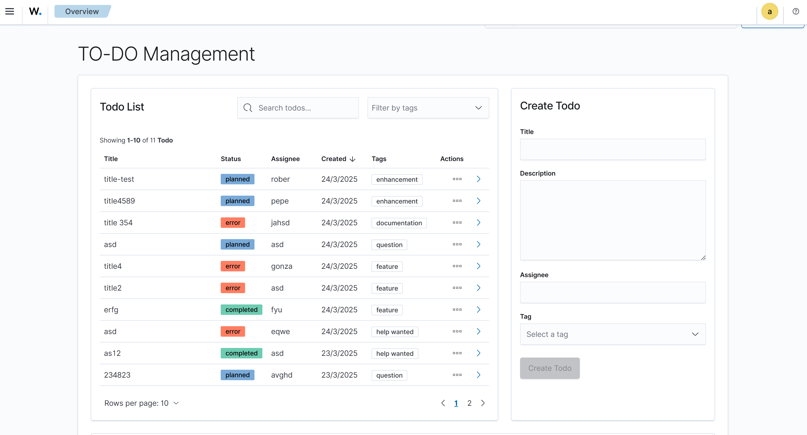
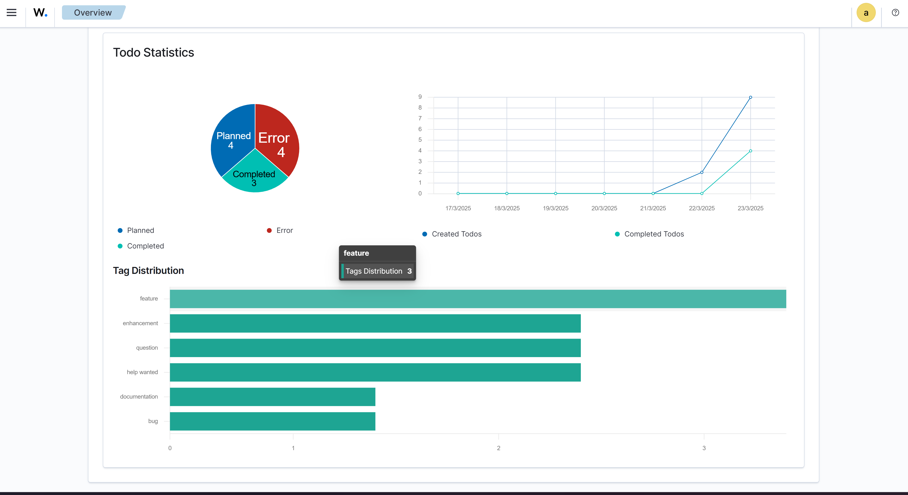

# 📋 Todo Plugin for OpenSearch Dashboards
## 🔍 Overview
This plugin provides a task management system for security professionals using Wazuh. It allows users to create, track, and manage tasks related to security processes and compliance standards like PCI DSS, ISO 27001, and SOX.

## 🎬 Demo Videos

For a better understanding of the project, I have prepared two demonstration videos:

### Functional Demo
This video shows the application in operation, highlighting all the main features and use cases:
[Watch Functional Demo](https://www.loom.com/share/d49f3233ab1e4bbfbc793a20a38ccf1e?sid=a3e0fff3-a127-4345-82e6-7c2671eab4d0)

### Technical Explanation
This video delves into the technical aspects of the project, explaining the architecture, design patterns, and implementation decisions:

[Watch Technical Explanation](https://www.loom.com/share/2acb419015ec4407b26fbe56d5948bf9)

## ✨ Features
- Create new tasks with title, status, assignee, description, and tags
- Track task status (planned, completed, error)
- Search tasks by text or tags
- Sort tasks by title, date, and status
- Visualize and update tasks in real-time through interactive tables and charts
  - Status distribution donut chart
  - Tag distribution bar chart
  - Timeline chart showing created vs completed tasks
- Responsive design that works on desktop and mobile devices
- Delete completed tasks
- Pagination support for large task lists
- Show details of a task

## 📸 Screenshots
Here are some screenshots of the application:


*Todo List View - Main interface showing all tasks*


*Task Analytics Dashboard - Visualizing task status and completion metrics*

## 🏗️ Architecture
The application consists of two main components: the frontend and the backend.

### 🖥️ Frontend
- Built with **ReactJS** and **OpenSearch Dashboards UI components**
- **Responsive design** with tables and charts for task visualization
- **Container/Presentational pattern**:
  - **Container components**: handle logic and state management
  - **Presentational components**: focus purely on UI rendering
- **State management using Zustand** for global state (lightweight alternative to Redux to avoid over-engineering)
- **Custom hooks** for:
  - Chart visualization and data processing
  - Component-specific state management
  - Reusable UI logic

#### Project FE Architecture/Structure
The frontend follows a modular architecture organized by feature:

 ```
src/public/
├── components/
│   ├── TodoAPP.tsx                # Main application component
│   └── todo/                      # Feature-based organization
│       ├── TodoList/              # Todo list feature
│       │   ├── components/        # Presentational components
│       │   │   ├── TodoSearch/ │       
│       │   │   │   ├── TodoSearch.tsx
│       │   │   │   ├── index.tsx
│       │   │   │   └── TodoSearch.test.tsx
│       │   │   └── TodoTable/
│       │   │       ├── TodoTable.tsx           # Presentational component
│       │   │       ├── TodoTableContainer.tsx  # Container component
│       │   │       ├── index.tsx
│       │   │       └── tests/
│       │   │           ├── TodoTable.test.tsx
│       │   │           └── TodoTableContainer.test.tsx
│       │   ├── tests/             # Unit tests
│       │   ├── index.tsx          # Main export
│       │   ├── TodoList.tsx       # Presentational component
│       │   └── TodoListContainer.tsx # Container component with business logic
│       ├── TodoForm/              # Todo creation feature
│       │   ├── components/
│       │   ├── hooks/
│       │   ├── tests/
│       │   ├── index.tsx
│       │   ├── TodoForm.tsx       # Presentational component
│       │   └── TodoFormContainer.tsx # Container component
│       └── TodoChart/             # Visualization feature
│           ├── components/
│           │   ├── StatusDonutChart/
│           │   │   ├── StatusDonutChart.tsx
│           │   │   ├── index.tsx
│           │   │   └── StatusDonutChart.test.tsx
│           │   ├── TagDistributionChart/
│           │   │   ├── TagDistributionChart.tsx
│           │   │   ├── index.tsx
│           │   │   └── TagDistributionChart.test.tsx
│           │   └── TimelineChart/
│           │       ├── TimelineChart.tsx
│           │       ├── index.tsx
│           │       └── TimelineChart.test.tsx
│           ├── hooks/
│           │   └── useChartData.ts  # Custom hook for chart data processing
│           ├── tests/
│           │   ├── TodoChart.test.tsx
│           │   └── TodoChartContainer.test.tsx
│           ├── index.tsx
│           ├── TodoChart.tsx       # Presentational component
│           └── TodoChartContainer.tsx # Container component
├── store/                         # Global state management
│   ├── index.ts                   # Zustand store initialization
│   └── slices/                    # Feature-based state slices
│       └── todoSlice.ts           # Todo-related state and actions
├── types/                         # TypeScript type definitions
│   ├── TodoChart.types.ts
│   ├── TodoList.types.ts
│   └── types.ts
├── utils/                         # Utility functions
│   ├── utils.ts
│   └── utils.test.ts
└── application.tsx                # Application entry point
```

#### FE Component Architecture
The application follows a clear separation of concerns:

1. **Container Components**: 
   - Handle data fetching, state management, and business logic
   - Connect to the Zustand store via hooks
   - Examples: `TodoListContainer`, `TodoFormContainer`, `TodoChartContainer`, `TodoTableContainer`

2. **Presentational Components**:
   - Focus purely on rendering UI based on props
   - Don't contain business logic or state management
   - Examples: `TodoList`, `TodoForm`, `TodoChart`, `TodoTable`

3. **Custom Hooks**:
   - Encapsulate reusable logic
   - `useChartData`: Processes todo data for visualization in charts
   - Used to separate data processing from rendering logic

This architecture promotes:
- **Reusability**: Components can be easily reused across the application
- **Testability**: Each component can be tested in isolation
- **Maintainability**: Clear separation of concerns makes the codebase easier to maintain
- **Scalability**: Adding new features or modifying existing ones is straightforward


### 🔧 Backend
- REST API built with NodeJS
- Controller-based architecture for better code organization
- OpenSearch for data persistence
- Singleton pattern for service management
- Comprehensive error handling and logging

#### Backend Architecture/Structure
The backend follows a modular architecture with clear separation of concerns:

```
src/server/
├── controllers/                # Business logic
│   ├── todoController.ts       # Handles todo operations
│   └── todoController.test.ts  # Unit tests for controller
├── services/                   # Service layer
│   ├── opensearchService.ts    # Singleton service for OpenSearch
│   └── opensearchService.test.ts # Unit tests for service
├── routes/                     # API endpoints
│   ├── index.ts                # Route definitions
│   └── index.test.ts           # Route tests
├── types.ts                    # TypeScript interfaces
├── plugin.ts                   # Plugin initialization
├── plugin.test.ts              # Plugin tests
└── index.ts                    # Entry point
```

#### API Endpoints
The plugin exposes the following RESTful endpoints:

| Method | Endpoint | Description |
|--------|----------|-------------|
| GET    | `/api/todo_plugin/todos` | Retrieve all todos |
| POST   | `/api/todo_plugin/todos` | Create a new todo |
| PUT    | `/api/todo_plugin/todos/{id}` | Update todo status |
| DELETE | `/api/todo_plugin/todos/{id}` | Delete a todo |

#### Design Patterns

1. **Singleton Pattern**
   - Used in `OpenSearchService` to ensure a single instance manages all OpenSearch connections
   - Provides centralized client access across the application

   ```typescript
   // OpenSearchService implementation
   export class OpenSearchService {
     private static instance: OpenSearchService;
     
     private constructor() { }
     
     public static getInstance(): OpenSearchService {
       if (!OpenSearchService.instance) {
         OpenSearchService.instance = new OpenSearchService();
       }
       return OpenSearchService.instance;
     }
     
     // Other methods...
   }
   ```
2. **Controller Pattern**
   
   - Separates business logic from routes
   - Handles data validation and processing
   - Interacts with OpenSearch service for data persistence
 
   ```typescript
   // TodoController implementation
   export class TodoController {
     private opensearchService: OpenSearchService;
     
     constructor() {
       this.opensearchService = OpenSearchService.getInstance();
     }
     
     // Methods: getTodos, createTodo, updateTodoStatus, deleteTodo
   }
    ```
   ```
1. **Dependency Injection**
   
   - Core services are injected into the plugin during setup
   - Improves testability by allowing mock services in tests Error Handling
  
The backend implements comprehensive error handling:

- Try/catch blocks in route handlers
- Detailed error messages for debugging
- Error logging through OpenSearch Dashboards logger Testing Strategy

The backend has tests covering:

- Unit tests for controllers, services, and routes
- Mock implementations for OpenSearch client
- Test coverage for success and error scenarios
- Isolated tests using Jest mocking

### 💾 Data Model
Each todo item contains:

- Title (required)
- Status (planned, completed, error)
- Creation date
- Completion date (when applicable)
- Assignee (optional)
- Description (optional)
- Tags (optional)

## 🚀 Installation
Running the Application: Instructions for running the application using Docker:
### Prerequisites
- Docker and Docker Compose
- Node.js 14+ (for development)
- At least 4GB of RAM available for Docker
- Increased virtual memory limit (for OpenSearch)

### Development Setup
1. Clone the repository:
   
   ```bash
   git clone https://github.com/gonzaarancibia/challenge-wazuh.git
   cd challenge-wazuh
   ```
2. Start the development environment:
   
   ```bash
   cd dev_environment
   docker-compose up -d
    ```
3. Access the container and install dependencies:
   
    ```bash
      # Access the container
      docker exec -it dev_environment-osd-1 /bin/bash

      # Navigate to the plugin directory
      cd /home/node/kbn/plugins/custom_plugin

      # Install dependencies
      yarn install
    ```
4. Start the OpenSearch Dashboards server:
   
   ```bash
      # Inside the container, navigate to the OpenSearch Dashboards directory
      cd /home/node/kbn

      # Start the server
      yarn start --no-base-path
   ```
  The server is ready when you see:

  ```
  server log [xx:xx:xx.xxx] [info][server][OpenSearchDashboards][http] http server running at http://0.0.0.0:5601
  ```
  - Note: The first time you start the server, it may take several minutes to optimize the code.

5. Access the application:
   
   - OpenSearch Dashboards: http://localhost:5601
   - Login with default credentials: admin / Wazuh-1234
   - Navigate to the menu and select "TO-DO Management"

### Stopping the Environment
```bash
    # Stop the containers
    docker-compose stop

    # Remove the containers and networks
    docker-compose down
```

### 🧪 Testing
Tests are implemented using Jest. To run the tests:

```bash
      # Access the container
      docker exec -it dev_environment-osd-1 /bin/bash

      # Navigate to the plugin directory
      cd /home/node/kbn/plugins/custom_plugin

      # Run tests
      npm run test
 ```


## 📖 Usage
### Creating a Todo
1. Navigate to the Todo Plugin in the OpenSearch Dashboards sidebar
2. Fill in the form on the right side with task details
3. Click "Create Todo" to save the task
 
### Managing Todos
- Use the search bar to filter tasks by text
- Use the tag selector to filter by specific tags
- Change task status using the dropdown in each row
- Delete tasks using the trash icon
- Click on the arrow icon in any task row to view its detailed description

### Viewing Analytics
The analytics dashboard at the bottom of the page shows:

- Status distribution (donut chart)
- Tag distribution (bar chart)
- Timeline of created vs completed tasks (line chart)

## 🧩 Development Challenges
During development, I faced some challenges:

- Had to configure virtual memory on a secondary disk since I couldn't increase it on the primary disk due to my computer's limited performance and resources
- Working with the OpenSearch client required understanding the specific query structure
- Initially struggled with Jest configuration for testing, but was able to make progress with help from Federico from the Wazuh team
- My computer's performance limitations made running the application and development environment challenging at times

## 🔮 Future Improvements
Some features I'd like to add:

- Error handling middleware implementation
  - Global error handler
  - Custom error classes
  - Structured error responses
- Swagger API documentation
  - OpenAPI 3.0 specifications
  - Interactive API documentation UI
  - Request/response examples
- End-to-end testing with Cypress
  - Test coverage for critical user flows
  - API integration tests
  - Mock service workers for testing
- Task prioritization
- Due dates and reminders
- Bulk operations for tasks
- Export/import functionality
- More advanced visualizations and analytics

## 🙏 Acknowledgments

Thank you to Wazuh for this great opportunity and challenge. Special thanks to Federico and the team for their support throughout the process.